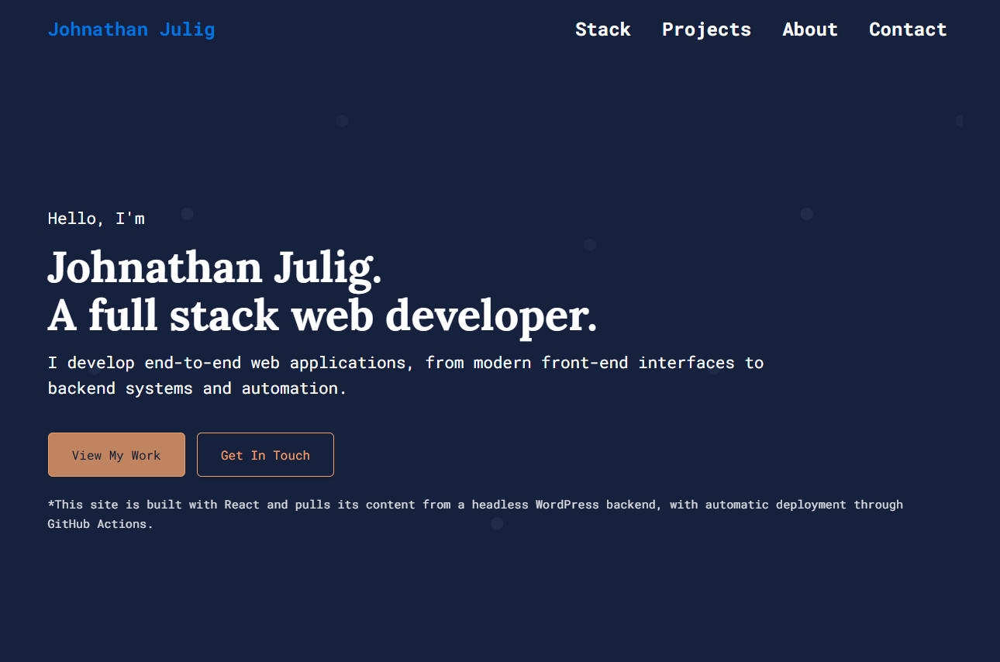
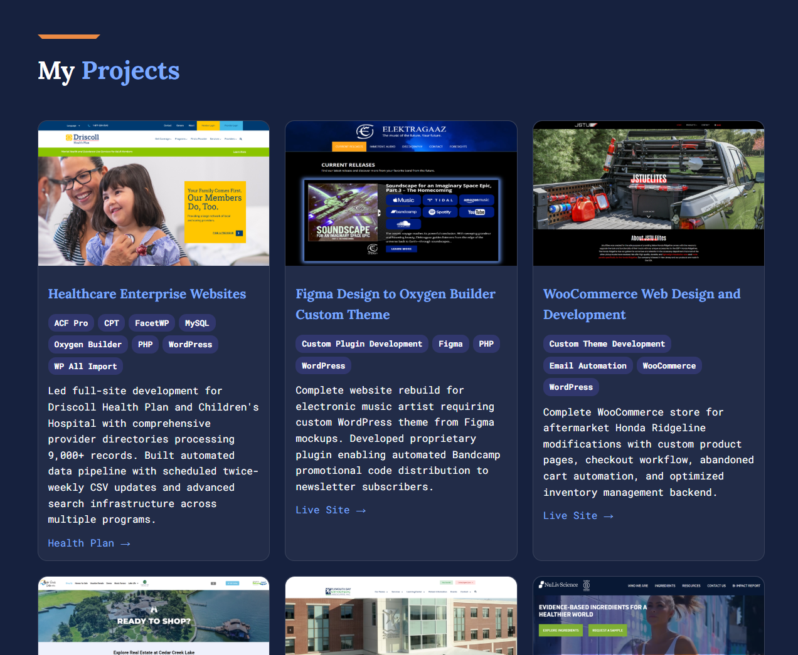

# React Portfolio (Headless WordPress + ACF)

This project is a personal portfolio built with **React (Vite)** and powered by a **Headless WordPress backend** using **Advanced Custom Fields (ACF)**.
It demonstrates how to fetch structured content from a CMS and render it dynamically on a modern frontend.

---

## Project Status

This repository represents a point-in-time build created for demonstration, experimentation, or portfolio review.

- Development state may vary over time
- Some dependencies or external integrations may require updates to run locally
- Code is provided for review of structure, patterns, and problem-solving approach
- Not intended as a drop-in production deliverable

This project is best evaluated by reviewing the codebase and commit history rather than expecting long-term maintenance or turnkey execution.

---

## 🚀 Features

### ✔ Headless WordPress Integration

All content (hero text, about section, projects, tech stack, contact info) is managed through WordPress using ACF fields.
The React app fetches these via the WP REST API and renders them as plain text.

### ✔ React Components & Clean Structure

The project uses a clear structure for:

- Layout
- Page sections
- API utilities
- Reusable components

### ✔ Safe, Clean Rendering

All dynamic fields are sanitized and rendered cleanly.

### ✔ EmailJS Contact Form

The contact form sends messages via EmailJS using service ID, template ID, and public key.

### ✔ Fast Build with Vite

Instant HMR and optimized production build.

---

## 📸 Screenshots

### **Hero Section**



### **Projects Section**



---

## 📁 Project Structure

```
src/
  api/
  components/
    layout/
    sections/
  assets/
  App.jsx
  main.jsx
```

---

## 🛠 Tech Stack

- React (Vite)
- Headless WordPress + ACF
- EmailJS
- JavaScript (ES6+)
- CSS / SCSS

---

## 🔌 Environment Variables

```
VITE_EMAILJS_SERVICE_ID=xxxxx
VITE_EMAILJS_TEMPLATE_ID=xxxxx
VITE_EMAILJS_PUBLIC_KEY=xxxxx
```

---

## ▶️ Running the Project

```
npm install
npm run dev
```

Open: `http://localhost:5173`

---

## 📦 Build

```
npm run build
npm run preview
```

---

## 📄 License

Personal portfolio project.
